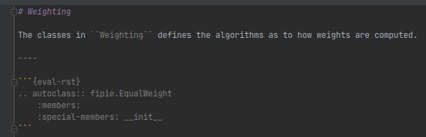
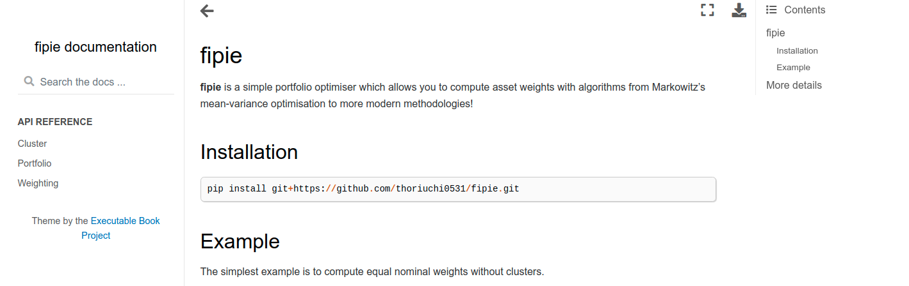
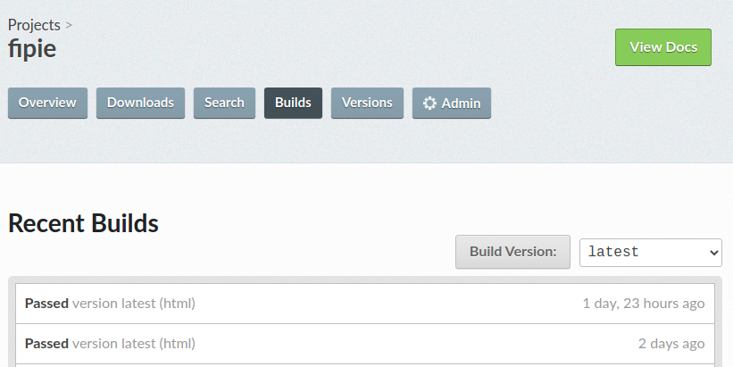

This month I just published my very first pypi package
called [fipie](https://pypi.org/project/fipie/0.0.2/){:target="_blank"}. The
package currently does simple portfolio optimisation stuff with clustering and
all that which by itself an interesting topic, but still simple enough. However,
to reach that stage -- creating docs, running a code coverage, understanding the
building/publishing process and automating all of these -- was quite a long
journey because I hadn't done any of these.

I try to summarise what I learnt so those who are new to the whole ecosystem
don't need to go through the same process as well. Franky speaking, it was not
straightforward to understand the whole process from beginning to end in one go.
With a python project on github, I decided to deal with the following points
before publishing to pypi:

- Write unit tests using `pytest`
- Run code coverage using `coverage`
- Write docstrings and build docs using `sphinx`
- Publish the doc on [readthedocs](https://fipie.readthedocs.io/en/latest/)
- Organise `pyproject.toml`, `setup.py` and `setup.cfg` and
  remove `requirements.txt`
- Build the package using `build`
- Use `setuptools_scm` for versioning using git tags
- Use github actions to automate tests, coverage and publish

I will cover them one by one below with some code snippets.

# Folder structure

As a first step, here's the final folder structure I ended up with. It only
shows the important folders and files that needed to be changed.

```bash
📁 fipie
├── 📁 .github
│    └── 📁 workflows
│         ├── 📝 coverage.yaml
│         ├── 📝 publish-to-test-pypi.yaml
│         └── 📝 tests.yaml
├── 📁 docs
│    ├── 📁 build
│    └── 📁 source
│         ├── 📁 api
│         │    ├── 📝 cluster.md
│         │    ├── ...
│         │    └── 📝 weighting.md
│         ├── 📝 conf.py
│         └── 📝 index.md
├── 📁 fipie
│    ├── 📁 data
│    │    └── 📝 price.csv
│    ├── 📝 __init__.py
│    ├── ...
│    └── 📝 cluster.py
├── 📁 tests
│    ├── 📝 __init__.py
│    ├── ...
│    └── 📝 test_cluster.py
├──📝 .gitignore
├──📝 .readthedocs.yaml
├──📝 MANIFEST.in
├──📝 pyproject.toml
├──📝 README.md
├──📝 setup.cfg
└──📝 setup.py
```

- **fipie** folder: root folder of the project.
- **fipie/.github/workflows** folder: yaml files for github actions
- **fipie/docs** folder: where all the docs are saved. Generated by `sphinx`
- **fipie/fipie/data** folder: static data that `fipie` needs. This needs to be
  shipped in the package
- **fipie/tests**: files for unit tests
- **fipie/.readthedocs.yaml**: yaml file to automate publishing the doc to
  readthedocs
- **fipie/MANIFEST.in**: specifies which files need to be packaged
- **fipie/pyproject.toml**: Main entry point for building the package
- **fipie/README.md**: Readme file that is used for the github and pypi main
  page
- **fipie/setup.cfg**: Static configuration data for building the package
- **fipie/setup.py**: Entry point for an editable install

# Write unit tests using `pytest`

First was to make sure that I write unit tests. This part is relatively easy and
just need to make sure to cover every bit of `if` statements so that the code
coverage is 100%. Also the test package doesn't need to be `pytest`, and can be
the plain `unittest`.

# Run code coverage using `coverage`

Next is to check how much of the code is covered by the tests written in the
previous section. To do that, first install `coverage`:

```bash
pip install coverage
```

Then in the root folder, execute the following command to check the code
coverage and produce a nice HTML report.

```bash
coverage run -m pytest && coverage html
```

It should produce an HTML page automatically under `fipie/htmlcov/index.html`.
On pycharm, right-click the html file then navigate **Open in -> Browser ->
Chrome** to open the file. It should show a page like below.


You can click a link there to drill down which section is covered or not.

# Write docstrings and build docs using `sphinx`

When writing a code it's also a good practice to add a docstring. It's useful
for others when they want to understand the parameters and their meaning.
Furthermore, it can be used to produce the documentation automatically.

I chose to use the `reStructuredText`(reST) style for the docstring. There are
other styles
like [numpy one](https://numpydoc.readthedocs.io/en/latest/format.html)
or [google one](https://sphinxcontrib-napoleon.readthedocs.io/en/latest/example_google.html)
.

```python
class MaximumDiversification(Weighting):
    r""" Create a portfolio which maximises the diversification factor

    .. math::
        \frac{ w^T \cdot \sigma }{ \sqrt{w^T \cdot \Sigma \cdot w} }

    where :math:`w` is the weight vector of each instrument, :math:`\sigma` is the volatility vector of each instrument,
    :math:`\Sigma` is the covariance matrix.
    The numerator of the diversification factor is a weighted average of instrument volatility whereas
    the denominator is the portfolio volatility after diversification.
    """

    def __init__(self, fully_invested: bool = True, bounds: Tuple[float, None] = (0, None)):
        """

        :param fully_invested: If True, weights are rescaled so that they add up to 100%. By default the optimal weights
            are rescaled to add up to 100% as the Sharpe ratio is scale-invariant with respect to the weight.
        :type fully_invested: bool, default True
        :param bounds: Lower and upper bounds of weights. If None, weights are unbounded, i.e., ``(0, None)`` means
            it only allows long positions.
        :type bounds: tuple, list-like

        .. note::
           With default parameters, this class produces a long-only fully-invested portfolio.
        """
        self.fully_invested = fully_invested
        self.bounds = bounds
```

There are some caveat though when writing a docstring in conjunction
with `sphinx` which are slightly different from writing a plain markdown text.

- You can embed a formula like above (the math directive), however in that case
  the whole comment section needs to start with `r` in order for the formula to
  be properly displayed.
- Make sure to have white spaces above and below the math directive, and intend
  on the same level in case a directive continues more than a single line

Once all docstrings are added (which is already tough), let's create some
folders where the documentation files are created. Luckily `sphinx` already has
a [script](https://www.sphinx-doc.org/en/master/usage/quickstart.html#setting-up-the-documentation-sources)
called `sphinx-quickstart` to do most of the work. By running this, it should
create the following important two folders:

- **/fipie/docs/build** : this is where the documentation built by `sphinx` is
  saved. You are not supposed to touch files in here.
- **/fipie/docs/source** : the configuration file (`conf.py`) and other
  templates are saved here.

## The configuration file `conf.py`

`conf.py` is also created with some default values by `sphinx-quickstart`. I
changed some of it to cater to my preference.

- Add extensions: mainly to be able to use markdown rather than reST.
- `sphinx.ext.autodoc` allows sphinx to read the docstrings and automatically
  generate documents.
- `source_suffix = ['.md']` to tell sphinx that I'm using markdown

```python
from pathlib import Path
import sys
sys.path.insert(0, Path(__file__).parent.parent.parent.as_posix())

project = 'fipie'
copyright = '2021'
author = 'Tomoya Horiuchi'

extensions = [
    'sphinx.ext.autodoc',
    'myst_parser',  # markdown support
    'sphinx.ext.mathjax',
]

source_suffix = ['.md']
master_doc = 'index'
templates_path = ['_templates']
exclude_patterns = []

html_theme = 'sphinx_book_theme'

html_static_path = ['_static']
```

## Markdown templates

This is where I wasn't able to automate completely. By this point, sphinx is
able to read docstrings and produce documents. But still I need to specify which
classes or functions to be included in the documentation. This means that if I
add a new class in the future, I would need to make sure these markdowns are
synchronised with the changes.

For instance /fipie/docs/source/api/weighting.md currently looks like this:


## Output the documentation

After `conf.py` and markdown templates are there, finally I can finally produce
the html documentation. The command to produce it is

```bash
make clean && make html
```

Then the HTML files should be produced in /fipie/docs/html/index.html

As per the coverage HTML file, you can open it from pycharm and it should show a
page something like below:

The theme of the documentation will be based on the `html_theme`
parameter defined in `conf.py` above.

# Publish the doc on [readthedocs](https://fipie.readthedocs.io/en/latest/)

At this stage the documentation is still hosted locally (on localhost).
Obviously this needs to be hosted somewhere so other people can
visit. [Read the Docs](https://readthedocs.org/) just fits the bill.

You can let readthedocs build the HTML documentation every time there is a push
on the github repository. The resulting doc is also hosted on their website. In
my case it
is [https://fipie.readthedocs.io/en/latest/](https://fipie.readthedocs.io/en/latest/)

The only thing readthedocs requires additionally is the configuration
file `.readthedocs.yaml`.
The [default parameters](https://docs.readthedocs.io/en/stable/config-file/v2.html)
is pretty much all I needed except the path for `conf.py` and the last line. In
the original yaml file, it uses `requirements.txt` to create an environment. As
I show later I ditch the file in favour of `setup.cfg`. In this case,
effectively I want them to run `pip install ".[dev]"` as opposed
to `pip install -r requirements.txt`. The last line specifies that.

```yaml
# .readthedocs.yaml
# Read the Docs configuration file
# See https://docs.readthedocs.io/en/stable/config-file/v2.html for details

# Required
version: 2

# Set the version of Python and other tools you might need
build:
  os: ubuntu-20.04
  tools:
    python: "3.9"
    # You can also specify other tool versions:
    # nodejs: "16"
    # rust: "1.55"
    # golang: "1.17"

# Build documentation in the docs/ directory with Sphinx
sphinx:
   configuration: docs/source/conf.py

# Optionally build your docs in additional formats such as PDF
# formats:
#    - pdf

# Optionally declare the Python requirements required to build your docs
python:
   install:
     - path: ".[dev]"
```

Their service is streamlined and doesn't require a huge amount of configuration.
You just need to create an account with github, select the project and that's
it. On the "Builds" page, you can see each builds corresponding to each push on
github. If you click one of the builds you can see what kind of commands are
executed on their side. (basically creating an environment and then run sphinx)



# Organise `pyproject.toml`, `setup.py` and `setup.cfg` and remove `requirements.txt`

Now that the documentation is hosted on readthedocs and I'm pretty happy with
the test and coverage, it's probably a good time to think about packaging.

To do that, I need a few extra configuration files like `setup.py` etc. My
understanding is that traditionally to build a package, one has to
create `setup.py` like the one
mentioned [here](https://simonwillison.net/2021/Nov/4/publish-open-source-python-library/)
and then call `python3 setup.py sdist`.

However, as mentioned
in [here](https://blog.ganssle.io/articles/2021/10/setup-py-deprecated.html),
this method is now deprecated and we should instead use a package called `build`
.

Additionally, it appears that there is a preference to `pyproject.toml` which is
basically a static configuration file like yaml over `setup.py` which is a
python script. (cf [here](http://ivory.idyll.org/blog/2021-transition-to-pyproject.toml-example.html))
Basically we prefer a static file (.cfg) rather than a dynamic one (.py).

With enough googling I ended up with the current state below.

## `pyproject.toml`

This file only tells what packages are needed for a building purpose. The last
two lines is an extra one for a library called `setuptool_scm`
to automate versioning. I will cover that in the later section. The toml file
should remain unchanged unless the build step is changed somehow.

```toml
[build-system]
requires = [
    'setuptools>=42',
    'wheel',
    'setuptools_scm>=6.2',
]
build-backend = 'setuptools.build_meta'

[tool.setuptools_scm]
write_to = 'fipie/version.py'
```

## `setup.py`

This file is very small as well. It's there to provide an entry point for
editable install. All the configurations that used to be here are moved to
the `setup.cfg`.

```python
import setuptools

if __name__ == "__main__":
    setuptools.setup(use_scm_version=True)
```

## `setup.cfg`

As can be seen below, this is now a static file defining the usual parameters
such as project name, requirements etc. There are I think two things which are
worth highlighting.

- package version should be **removed** from `setup.cfg`. Usually an author
  needs to write down the version here but I will let `setuptools_scm` take care
  of it.
- required packages are defined in `setup.cfg` as opposed to `requirements.txt`.
  This mean we don't need to have `requirements.txt` in the project. I also need
  to define extra packages for development so `pip install ".[dev]"`
  works. This is for readthedocs as mentioned above.

Also there are a few things I didn't fully understand until the very last:

- `packages = find:`: Without this, the wheel doesn't contain any .py files
  while the source distribution still works
- `include_package_data = true` : Again for the wheel, this is needed to include
  non-python files like fipie/fipie/data/price.csv

```bash
[metadata]
name = fipie
description = A simple portfolio optimiser beyond the mean-variance optimisation
long_description = file: README.md
long_description_content_type = text/markdown; charset=UTF-8
keywords =
    finance
    investing
    portfolio-optimization
    quantitative-finance
    portfolio-management
url = https://github.com/thoriuchi0531/fipie
author = Tomoya Horiuchi
author_email = thoriuchi0531@gmail.com
license = MIT
classifiers =
    Development Status :: 3 - Alpha
    License :: OSI Approved :: MIT License
    Programming Language :: Python :: 3.6
    Programming Language :: Python :: 3.7
    Programming Language :: Python :: 3.8
    Programming Language :: Python :: 3.9
    Topic :: Office/Business :: Financial :: Investment
project_urls =
    Documentation = https://fipie.readthedocs.io/en/latest/
    Source = https://github.com/thoriuchi0531/fipie

[options]
packages = find:
include_package_data = true
python_requires = >=3.6
install_requires =
    pandas>=0.25
    scipy>=1.0

[options.extras_require]
dev =
    pytest>=6.2.5
    coverage>=6.0.2
    sphinx==4.2.0
    sphinx-book-theme==0.1.6
    myst_parser==0.15.2
```

# Build the package using `build`

With all the configurations above, the package can now be built using the
library `build`.

```bash
python -m build --sdist --wheel
```

Note that I'm not invoking the `setup.py` anymore. This command should create
the source dist and wheel under /fipie/dist

For now, those outputs should be versioned 0.1 by default and probably with some
garbage suffix, unless a git tag is already used. The way to control it is
mentioned in the section below.

# Use `setuptools_scm` for versioning using git tags

I mentioned that versioning is taken care of the package `setuptools_scm`. This
means that I don't even need to have `__version__` that is typically defined
in  `__init__.py`, and it doesn't require me having to manually update the
number every time.

The way `setuptools_scm` handles is that it utilises the git tag. So the
workflow would be

1. Make changes to the code base
2. Commit all changes to the local repository
3. Add a tag to the current commit (e.g., run `git tag v0.0.1`)
4. If I build at this point, the source dist and wheel versioned 0.0.1 would be
   created. Additionally `version.py` would be created automatically.

In addition to this, in order for `fipie.__verion__` to work in python, the
following section is added to `fipie.__init__.py`.

```python
from pkg_resources import get_distribution, DistributionNotFound

try:
    _version = get_distribution(__name__).version
except DistributionNotFound:
    from .version import version as _version

__version__ = _version
```

With this, I don't need to touch `__init__.py` every time I increment a verison.

# Use github actions to automate tests, coverage and publish to pypi

Finally, let's make a use of github action to automate tests, coverage and
publication to pypi. Concretely, I wanted github to do the followings upon every
push:

- Run unit tests like above, but across different python versions and OS
- Run coverage and upload the result to Codecov
- If the test above is successful, build the package and publish to pypi *if the
  latest commit is tagged correctly*.

## unit tests

This is relatively straightforward and you should see similar examples
everywhere. At the moment the `matrix` is across 3 OS and 4 python versions,
resulting 12 different combinations to pass. This workflow is executed every
time there is a push to the `main` branch.

```yaml
name: tests
on:
  push:
    branches:
      - main

jobs:
  unittest:
    name: Run pytest across python versions and platforms
    runs-on: ${{ matrix.os }}
    strategy:
      matrix:
        os: [ ubuntu-latest, windows-latest, macos-latest ]
        python-version: [ '3.6', '3.7', '3.8', '3.9' ]
    steps:
      - uses: actions/checkout@v2

      - name: Set up Python
        uses: actions/setup-python@v2
        with:
          python-version: ${{ matrix.python-version }}

      - name: Install python dependencies
        run: pip install ".[dev]"

      - name: Display installed libraries
        run: pip list

      - name: Run pytest
        run: pytest
```

## coverage

This is basically a copy-and-paste from the unit test.

```yaml
name: coverage
on:
  push:
    branches:
      - main

jobs:
  coverage:
    name: Run code coverage
    runs-on: ${{ matrix.os }}
    strategy:
      matrix:
        os: [ ubuntu-latest ]
        python-version: [ '3.9' ]
    steps:
      - uses: actions/checkout@v2

      - name: Set up Python
        uses: actions/setup-python@v2
        with:
          python-version: ${{ matrix.python-version }}

      - name: Install python dependencies
        run: pip install ".[dev]"

      - name: Generate report
        run: coverage run -m pytest

      - name: Upload Coverage to Codecov
        uses: codecov/codecov-action@v2
```

## Publish

Finally, the yaml below is to publish the package to pypi. Broadly, this is
based on the link [here](https://packaging.python.org/en/latest/guides/publishing-package-distribution-releases-using-github-actions-ci-cd-workflows/) with some tweaks.

- This workflow is only kicked off when the unit test workflow is finished. This
  dependency across workflows seems to be relatively a new feature on github
- However this dependency doesn't care if the previous workflow is successful or
  not. `if: ${{ github.event.workflow_run.conclusion == 'success' }}` takes care
  of that.
- The two `fetch` commands get git tags because I rely on `setuptools_scm` for
  versioning with tags. **This means tags need to be pushed to remote as well**
- The last two jobs publish the package to testpypi and pypi respectively. If
  the latest commit is tagged properly, the dist should be versioned like "
  v0.0.1" and will be pushed to pypi. Otherwise, it would be versioned with a
  distance from the latest tag (
  eg, `{next_version}.dev{distance}+{scm letter}{revision hash}.dYYYYMMDD`)
  which pypi doesn't like, and the publication would fail.

```yaml
name: publish
on:
  workflow_run:
    workflows: [ 'tests' ]
    branches:
      - main
    types:
      - completed

jobs:
  build-n-publish:
    name: Build and publish Python 🐍 distributions 📦 to PyPI and TestPyPI
    runs-on: ubuntu-18.04
    if: ${{ github.event.workflow_run.conclusion == 'success' }}
    steps:
      - name: Check out src from Git
        uses: actions/checkout@v2

      - name: Get history and tags for SCM versioning to work
        run: |
          git fetch --prune --unshallow
          git fetch --depth=1 origin +refs/tags/*:refs/tags/*

      - name: Set up Python 3.9
        uses: actions/setup-python@v2
        with:
          python-version: 3.9

      - name: Install pypa/build
        run: >-
          python -m
          pip install
          build
          --user

      - name: Build a binary wheel and a source tarball
        run: >-
          python -m
          build
          --sdist
          --wheel
          --outdir dist/
          .

      - name: Publish distribution 📦 to Test PyPI
        uses: pypa/gh-action-pypi-publish@master
        with:
          password: ${{ secrets.TEST_PYPI_API_TOKEN }}
          repository_url: https://test.pypi.org/legacy/

      - name: Publish distribution 📦 to PyPI
        uses: pypa/gh-action-pypi-publish@master
        with:
          password: ${{ secrets.PYPI_API_TOKEN }}
```

That's it! I would have never imagined that the publication process was so hard
and every package goes through this kind of process. The entire project can be
found here [https://github.com/thoriuchi0531/fipie](https://github.com/thoriuchi0531/fipie)

# Reference

## sphinx

- sphinx math support: [https://www.sphinx-doc.org/en/1.5.1/ext/math.html](https://www.sphinx-doc.org/en/1.5.1/ext/math.html)

## Around building python packages

- How to build, test and publish an open source Python
  library: [https://simonwillison.net/2021/Nov/4/publish-open-source-python-library/](https://simonwillison.net/2021/Nov/4/publish-open-source-python-library/)
- Why you shouldn't invoke setup.py
  directly: [https://blog.ganssle.io/articles/2021/10/setup-py-deprecated.html](https://blog.ganssle.io/articles/2021/10/setup-py-deprecated.html)
- Transition your Python project to use pyproject.toml and setup.cfg! (An
  example.): [http://ivory.idyll.org/blog/2021-transition-to-pyproject.toml-example.html](http://ivory.idyll.org/blog/2021-transition-to-pyproject.toml-example.html)
- pyproject.toml vs
  setup.py: [https://stackoverflow.com/questions/62983756/what-is-pyproject-toml-file-for](https://stackoverflow.com/questions/62983756/what-is-pyproject-toml-file-for)
- Github action for publishing to
  pypi: [https://packaging.python.org/en/latest/guides/publishing-package-distribution-releases-using-github-actions-ci-cd-workflows](https://packaging.python.org/en/latest/guides/publishing-package-distribution-releases-using-github-actions-ci-cd-workflows)
- Github action dependencies across
  workflows: [https://stackoverflow.com/questions/63343937/how-to-use-the-github-actions-workflow-run-event](https://stackoverflow.com/questions/63343937/how-to-use-the-github-actions-workflow-run-event)
- Github action and setuptools_scm: [https://github.com/pypa/setuptools_scm/issues/414](https://github.com/pypa/setuptools_scm/issues/414)
